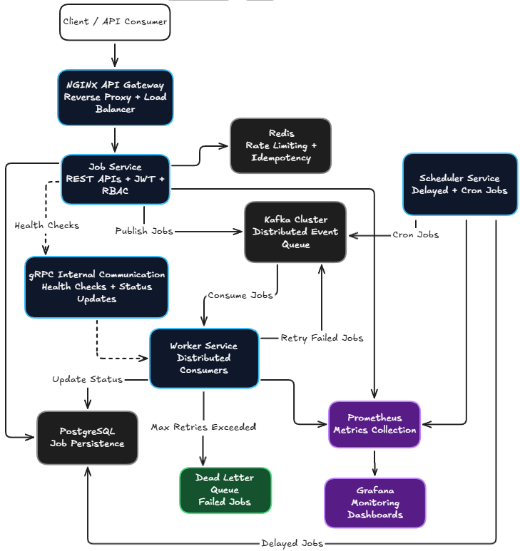
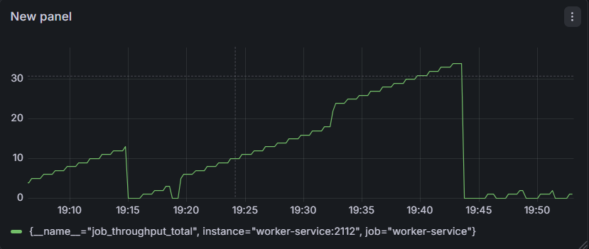
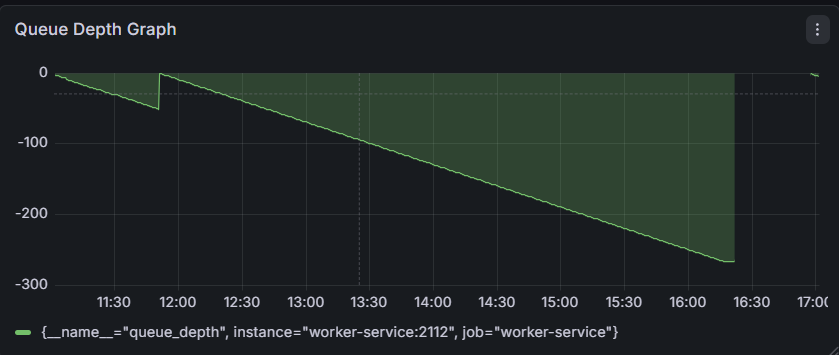
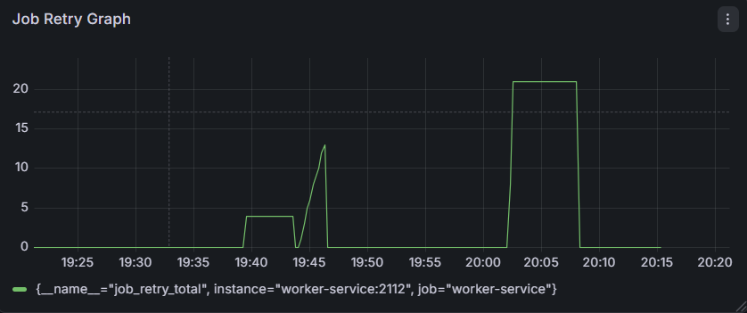
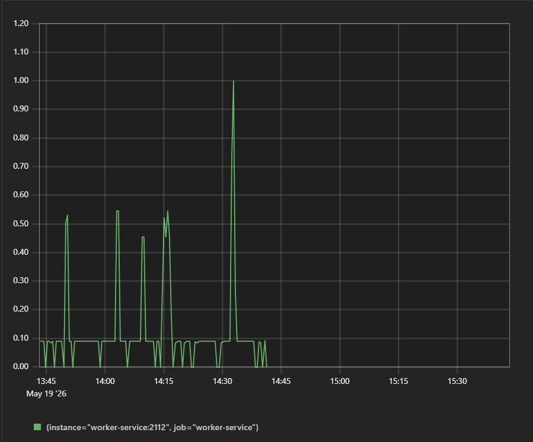

# QueueFlow — Distributed Job Processing Platform

## Overview

QueueFlow is a distributed asynchronous job processing platform built using Go, Kafka, PostgreSQL, Redis, gRPC, Prometheus, and Grafana.

The system simulates production-grade backend infrastructure capable of handling asynchronous workflows, distributed worker orchestration, retries, dead-letter queues, delayed jobs, recurring cron jobs, observability, authentication, rate limiting, and scalable event-driven processing.

QueueFlow demonstrates modern backend engineering concepts used in real-world distributed systems and infrastructure platforms.

---

# Features

- Distributed asynchronous job processing
- Kafka-based event-driven architecture
- Concurrent worker pool orchestration
- Retry mechanisms with exponential backoff
- Dead Letter Queue (DLQ)
- Delayed job scheduling
- Recurring cron jobs
- JWT authentication
- Role-Based Access Control (RBAC)
- Redis-based rate limiting
- Backpressure handling
- Circuit breaker pattern
- Prometheus metrics
- Grafana dashboards
- gRPC internal communication
- NGINX API Gateway
- CI/CD using GitHub Actions
- Load testing using k6
- Kafka partition optimization
- Worker concurrency tuning

---

# Architecture Diagram



---

# System Architecture

QueueFlow follows a distributed event-driven microservice architecture.

### Core Components

| Component         | Responsibility                          |
| ----------------- | --------------------------------------- |
| Job Service       | Handles API requests and publishes jobs |
| Kafka             | Distributed event queue                 |
| Worker Service    | Consumes and processes jobs             |
| Scheduler Service | Handles delayed and recurring jobs      |
| PostgreSQL        | Persistent job storage                  |
| Redis             | Rate limiting and idempotency           |
| Prometheus        | Metrics collection                      |
| Grafana           | Monitoring dashboards                   |
| NGINX             | Reverse proxy and API gateway           |
| gRPC              | Internal service communication          |

---

# Tech Stack

## Backend

- Go (Golang)
- Gin Framework
- gRPC
- Zap Logger

## Infrastructure

- Apache Kafka
- PostgreSQL
- Redis
- Docker
- Docker Compose
- NGINX

## Observability

- Prometheus
- Grafana

## Security

- JWT Authentication
- RBAC
- Rate Limiting

## Performance Testing

- k6 Load Testing

---

# Distributed Workflow

## Job Processing Flow

```text
Client Request
↓
NGINX API Gateway
↓
Job Service
↓
Kafka Topic
↓
Worker Service
↓
PostgreSQL Status Update
```

---

# Retry & Dead Letter Queue (DLQ)

QueueFlow implements fault-tolerant processing using retries and dead-letter queues.

## Retry Mechanism

- Exponential backoff retry strategy
- Configurable retry count
- Retry metrics tracking

## Dead Letter Queue

Failed jobs exceeding retry limits are:

- published to DLQ
- persisted in PostgreSQL
- logged for observability

---

# Scheduling System

QueueFlow supports:

## Delayed Jobs

```json
{
  "execute_at": "2026-05-20T10:00:00Z"
}
```

## Recurring Cron Jobs

Implemented using:

- robfig/cron

Scheduler service dispatches recurring jobs to Kafka asynchronously.

---

# Security Features

## JWT Authentication

Secures:

- job APIs
- admin endpoints

## Role-Based Access Control

Supported roles:

- ADMIN
- USER
- WORKER

## Rate Limiting

Implemented using:

- Redis sliding window strategy

---

# Observability & Monitoring

QueueFlow provides production-grade observability using Prometheus and Grafana.

## Metrics Tracked

- Queue depth
- Job throughput
- Retry count
- Worker failures
- Job latency

---

# Monitoring Dashboards

## Queue Throughput



---

## Queue Depth



---

## Retry Metrics



---

## Job Latency



---

# gRPC Internal Communication

QueueFlow uses gRPC for:

- internal service communication
- health checks
- worker coordination
- status updates

---

# Performance Benchmarking

Load testing performed using k6.

## Benchmark Results

| Workers   | Avg Latency | Throughput  |
| --------- | ----------- | ----------- |
| 1 Worker  | ~7ms        | ~39 req/sec |
| 2 Workers | ~3ms        | ~39 req/sec |
| 4 Workers | ~3ms        | ~39 req/sec |
| 8 Workers | ~2.9ms      | ~39 req/sec |

---

# Performance Optimizations

Implemented optimizations:

- Kafka partition tuning
- Worker concurrency tuning
- Database indexing
- Backpressure protection
- Circuit breaker pattern

---

# API Endpoints

## Authentication

```http
POST /login
```

## Create Job

```http
POST /jobs
```

## Delayed Job

```json
{
  "queue_name": "email",
  "payload": {
    "id": 1
  },
  "execute_at": "2026-05-20T10:00:00Z"
}
```

---

# Running Locally

## Clone Repository

```bash
git clone https://github.com/aakash811/QueueFlow.git
cd QueueFlow
```

## Start Services

```bash
docker compose up --build
```

---

# Services

| Service     | Port  |
| ----------- | ----- |
| Job Service | 8080  |
| Prometheus  | 9090  |
| Grafana     | 3000  |
| Metrics     | 2112  |
| gRPC        | 50051 |

---

# Future Improvements

- Kubernetes deployment
- OpenTelemetry tracing
- Priority queues
- Multi-tenant queue support
- Web dashboard
- Persistent cron orchestration
- Terraform infrastructure provisioning

---

# Key Engineering Concepts Demonstrated

- Distributed systems
- Event-driven architecture
- Asynchronous processing
- Fault tolerance
- Scalability
- Observability
- Infrastructure engineering
- Microservices
- Performance optimization
- Backend reliability engineering

---

# Author

Aakash Borse

GitHub:
https://github.com/aakash811
